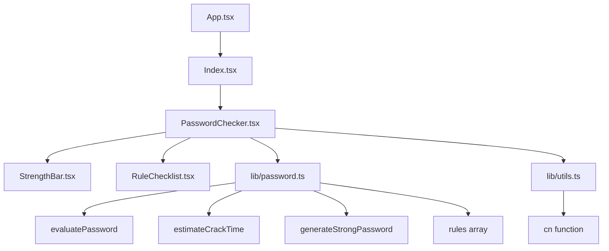

# Password Strength Checker

A modern React application for checking password strength with real-time feedback and visual indicators.

## Features

- Real-time password strength analysis
- Visual strength bar with color-coded levels
- Comprehensive rule checklist
- Responsive design with dark mode support
- Built with TypeScript for type safety

## Technologies Used

- **Vite** - Fast build tool and development server
- **React** - UI library
- **TypeScript** - Type-safe JavaScript
- **shadcn/ui** - Modern UI components
- **Tailwind CSS** - Utility-first CSS framework
- **Vitest** - Testing framework

## Architecture

The application follows a component-based architecture built with React and TypeScript. The main functionality is contained in the `PasswordChecker` component, which orchestrates password validation, strength calculation, and UI updates.

### Component Hierarchy



### Key Components

- **PasswordChecker**: Main component handling user input, state management, and rendering sub-components
- **StrengthBar**: Visual indicator of password strength with animated progress
- **RuleChecklist**: Displays validation rules with checkmarks for met criteria
- **Password Library**: Contains core logic for password analysis and generation

### Data Flow

1. User types in the password input
2. `PasswordChecker` calls `evaluatePassword` to assess strength
3. Results update the UI components (StrengthBar, RuleChecklist)
4. Additional features like copy and generate use utility functions

## Getting Started

### Prerequisites

- Node.js (version 18 or higher)
- npm or yarn

### Installation

1. Clone the repository:
   ```bash
   git clone <your-repo-url>
   cd password-strength-checker
   ```

2. Install dependencies:
   ```bash
   npm install
   ```

3. Start the development server:
   ```bash
   npm run dev
   ```

4. Open [http://localhost:5173](http://localhost:5173) in your browser.

### Available Scripts

- `npm run dev` - Start development server
- `npm run build` - Build for production
- `npm run preview` - Preview production build
- `npm run lint` - Run ESLint
- `npm run test` - Run tests
- `npm run test:watch` - Run tests in watch mode

## Project Structure

```
src/
├── components/
│   ├── PasswordChecker.tsx    # Main password checker component
│   ├── StrengthBar.tsx        # Visual strength indicator
│   ├── RuleChecklist.tsx      # Password rules checklist
│   └── ui/                    # shadcn/ui components
├── lib/
│   ├── password.ts            # Password validation logic
│   └── utils.ts               # Utility functions
├── pages/
│   ├── Index.tsx              # Home page
│   └── NotFound.tsx           # 404 page
└── hooks/                     # Custom React hooks
```

## Contributing

1. Fork the repository
2. Create a feature branch
3. Make your changes
4. Run tests: `npm run test`
5. Run lint: `npm run lint`
6. Commit your changes
7. Push to the branch
8. Open a Pull Request

## License

This project is open source and available under the [MIT License](LICENSE).
